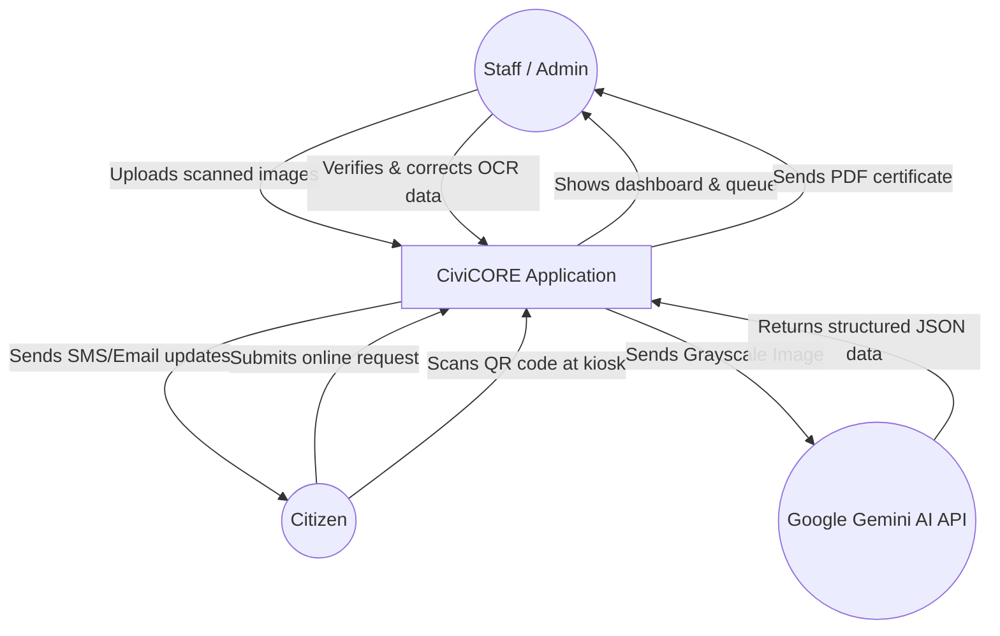
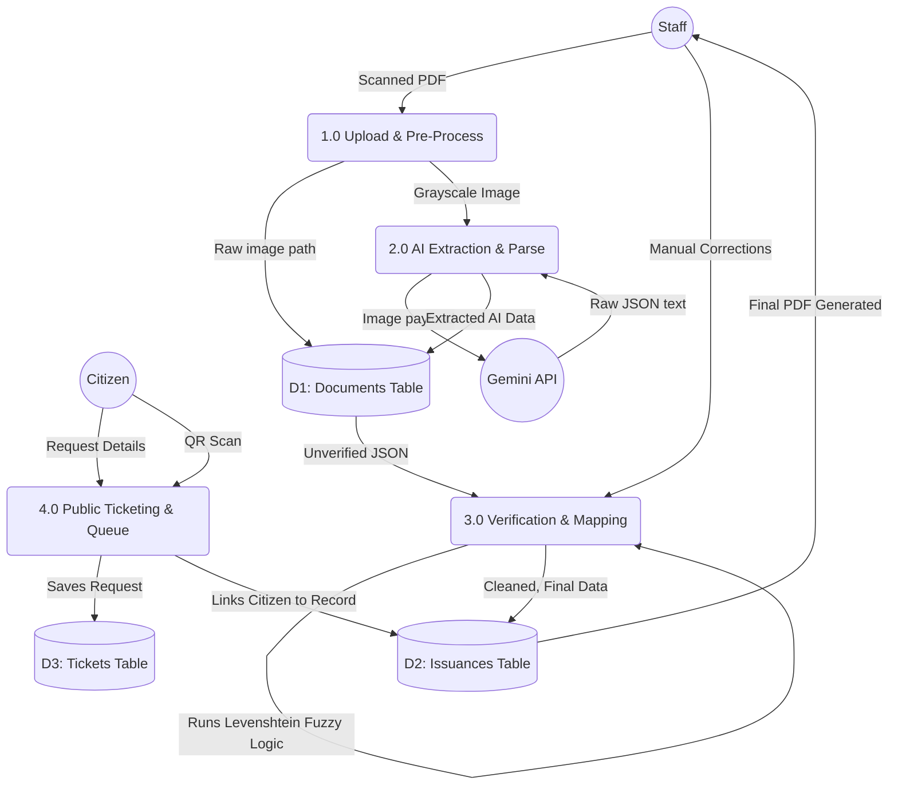

# Data Flow Diagram (DFD)

A Data Flow Diagram (DFD) maps out the flow of information for any process or system. Below are two levels of DFDs representing the CiviCORE system, written in Mermaid syntax.

> [!TIP]
> The diagrams below use Mermaid syntax. If you are viewing this in a markdown viewer that supports Mermaid (like GitHub or many code editors), it will render as a beautiful visual graphic. If not, the text structure perfectly explains the data flow!

---

## Level 0 DFD: Context Diagram
This is a high-level view showing the entire CiviCORE system as a single process and how external entities (Citizens, Staff, and APIs) interact with it.

---

## Level 1 DFD: Sub-Process Breakdown
This breaks down the "CiviCORE Application" from the Context Diagram into the actual internal processes and data stores (tables).

## How to Explain This DFD to the Panel:

1.  **Level 0 (Context):** Keep it simple. "Our system interacts with three main outside actors: The Staff, The Citizen, and the Google Gemini API. Data flows in through uploads and forms, and flows out as PDFs and structured JSON."
2.  **Level 1 (Sub-Process):** Point to the 4 main processes. 
    *   **Process 1.0:** The staff uploads the file, and we pre-process it to grayscale. It hits the `Documents` table.
    *   **Process 2.0:** We send it to Gemini, and Gemini gives us JSON back.
    *   **Process 3.0:** The staff looks at the JSON side-by-side with the image. When they click save, our Fuzzy Logic algorithm corrects the Barangay names, and the data is finalized into the `Issuances` table.
    *   **Process 4.0:** A citizen requests a document online. The system creates a Ticket, links it to the final Issuance, and generates the physical copy for printing.
