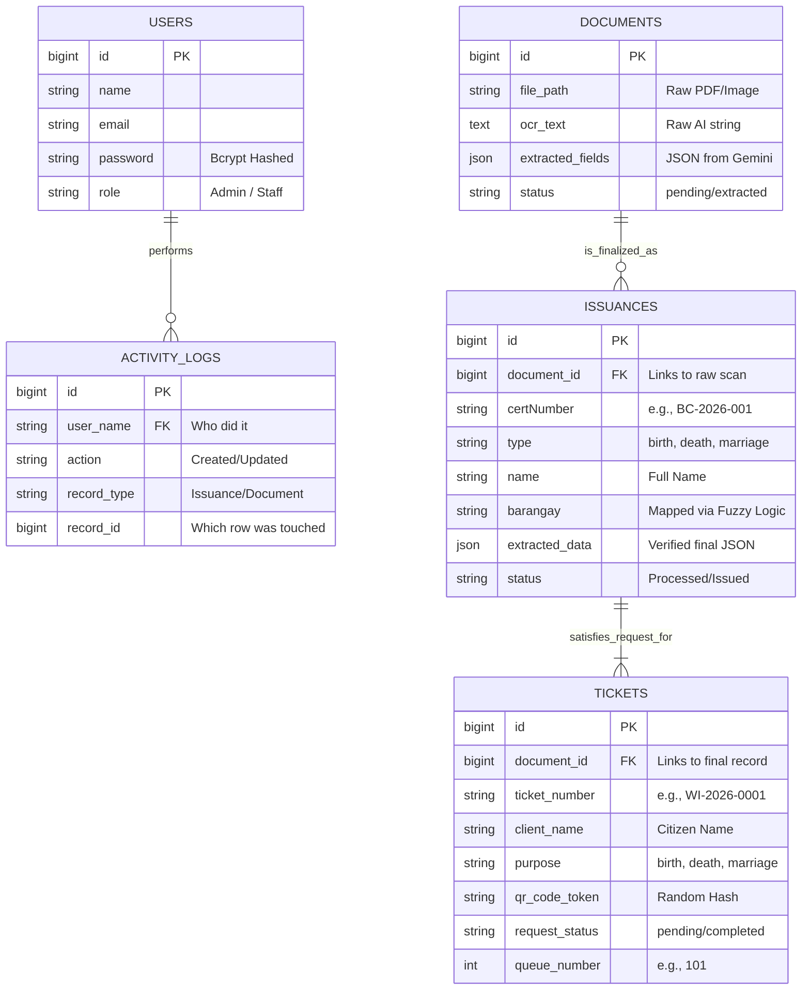

# Entity Relationship Diagram (ERD)

This is the ERD for the CiviCORE database. You can show this to the panelists to explain how the core tables in your MySQL database relate to each other. 

> [!TIP]
> The diagram below uses Mermaid syntax. If you are viewing this in a markdown viewer that supports Mermaid (like GitHub or many code editors), it will render as a beautiful visual graphic. If not, the text structure perfectly explains the relationships!

## How to Explain This ERD to the Panel:

1.  **Users & Logs (1-to-Many):** One User can perform Many Activity Logs. This ensures strict accountability for who edits what.
2.  **Documents & Issuances (1-to-1/Many):** A `document` is the messy, raw scan. Once verified, it generates a clean `issuance` (the official registry record). The `document_id` acts as a Foreign Key so you can always trace an official record back to the original physical paper.
3.  **Tickets & Issuances:** A `ticket` represents a citizen waiting in the lobby. When staff process their ticket, the system links the ticket to the finalized `issuance` so the physical paper can be printed and handed to the citizen.
